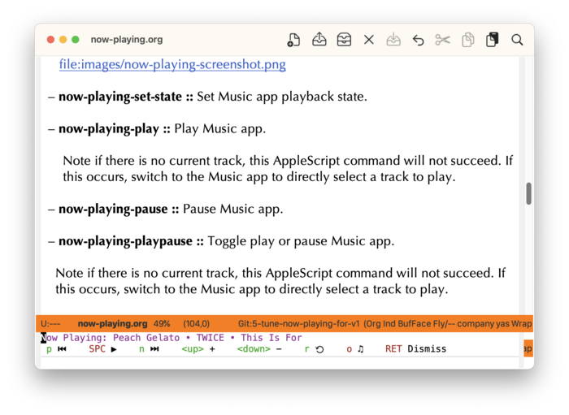

#+startup: overview nologdone
#+startup: showeverything
#+TITLE: Now Playing User Guide
#+SUBTITLE: for version {{{version}}}
#+AUTHOR: Charles Y. Choi
#+EMAIL: kickingvegas@gmail.com
#+OPTIONS: ':t toc:t author:t email:t H:4 f:t
#+LANGUAGE: en
#+MACRO: version 0.9.3-rc.1
#+MACRO: kbd (eval (org-texinfo-kbd-macro $1))
#+TEXINFO_FILENAME: now-playing.info
#+TEXINFO_CLASS: casual
#+TEXINFO_HEADER: @syncodeindex pg cp
#+TEXINFO_HEADER: @paragraphindent none
#+TEXINFO_TITLEPAGE: t
#+TEXINFO_DIR_CATEGORY: Emacs misc features
#+TEXINFO_DIR_NAME: Now Playing
#+TEXINFO_DIR_DESC: A “Now Playing” interface for the macOS Music app.
#+TEXINFO_PRINTED_TITLE: Now Playing User Guide

Version: {{{version}}}

#+TEXINFO: Copyright © 2026 @w{Charles Y. Choi}

*Now Playing* is an Emacs “now playing” interface for the macOS [[https://en.wikipedia.org/wiki/Music_%28app%29][Music app]]. *Now Playing* provides a  Transient menu interface ([[info:transient#Top]]) to control the *Music app* with the following commands:

- Pause/Play (~SPC~, ▶/⏸)
- Previous (~p~, ⏮) and Next (~n~, ⏭) Track
- Open (launch) Music app (~o~, ♫)
- Increase (~<up>~) and Decrease (~<down>~) volume
- Refresh current track (~r~, ⟲)

*Now Playing* is intended to be an ancillary interface to the Music app, providing only a subset of controls to it. It has no long-term agenda to be a full-featured client of *Music app*.

#+INCLUDE: "./sponsorship.org"

* Copying
:PROPERTIES:
:COPYING: t
:END:

Copyright © 2026 Charles Y. Choi

* Features
:PROPERTIES:
:CUSTOM_ID: features
:END:
#+CINDEX: Features

- Transient menu interface to control *Music app*.

  ~M-x~ ~now-playing-tmenu~

- Display the current playing track in the mini-buffer.

  ~M-x~ ~now-playing-current-track~

- Periodically poll the *Music app* to display the current track in the mini-buffer.

  ~M-x~ ~now-playing-start-polling-current-track~

  When polling is turned on, an in-memory log is kept in the special buffer ~✱now playing log✱~. It can be opened with the command ~now-playing-find-log~.

  Polling can be stopped with the command ~now-playing-cancel-polling~.

- Uses Emacs ~ns-do-applescript~ to directly call AppleScript for performance.

* Install
:PROPERTIES:
:CUSTOM_ID: install
:END:
#+CINDEX: Install

*Now Playing* is available to install from MELPA (TBD).

Manual installation can be done by ensuring that ~now-playing.el~ is available in the Emacs ~load-path~ variable.

The Transient interface and commands for polling are auto-loaded so no configuration is necessary. That said, users might find it convenient to make a keybinding to the Transient menu ~now-playing-tmenu~ as follows:

#+begin_src elisp :lexical no
  (keymap-global-set "<f14>" #'now-playing-tmenu)
#+end_src

The keybinding itself can be set to user preference.

* Commands
#+CINDEX: Commands

The primary interface for *Now Playing* is the Transient menu ~now-playing-tmenu~. It can be invoked via ~execute-extended-command~ {{{kbd(M-x)}}}.

Listed below are commands to both control or get current information from the Music app.

- now-playing-tmenu :: Transient menu for *Now Playing*.
  #+VINDEX: now-playing-tmenu

   

   The following commands are provided:

    - Pause/Play (~SPC~, ▶/⏸)
    - Previous (~p~, ⏮) and Next (~n~, ⏭) Track
    - Open (launch) Music app (~o~, ♫)
    - Increase (~<up>~) and Decrease (~<down>~) volume
    - Refresh current track (~r~, ⟲)

- now-playing-set-state :: Set Music app playback state.
  #+VINDEX: now-playing-set-state

- now-playing-play :: Play Music app.
  #+VINDEX: now-playing-play

    Note if there is no current track, this AppleScript command will not succeed. If this occurs, switch to the Music app to directly select a track to play.

- now-playing-pause :: Pause Music app.
  #+VINDEX: now-playing-pause

- now-playing-playpause :: Toggle play or pause Music app.
  #+VINDEX: now-playing-playpause

  Note if there is no current track, this AppleScript command will not succeed. If this occurs, switch to the Music app to directly select a track to play.

- now-playing-stop :: Stop Music app.
  #+VINDEX: now-playing-stop

  Note this command will deselect the current track in the Music app, making the commands ~now-playing-play~ and ~now-playing-playpause~ ineffective. If this occurs, switch to the Music app and select a track to resume expected behavior.

- now-playing-next-track :: Next track Music app.
  #+VINDEX: now-playing-next-track

  Note if this command is called when on the last track of the playlist or album will deselect the current track.

- now-playing-previous-track :: Previous track Music app.
  #+VINDEX: now-playing-previous-track

  Note if this command is called when on the first track of the playlist or album will deselect the current track.

- now-playing-get-volume :: Get Music app sound volume.
  #+VINDEX: now-playing-get-volume

- now-playing-set-volume :: Set Music app sound volume to ARG.
  #+VINDEX: now-playing-set-volume

- now-playing-increase-volume :: Increase Music app sound volume.
  #+VINDEX: now-playing-increase-volume

- now-playing-decrease-volume :: Decrease Music app sound volume.
  #+VINDEX: now-playing-decrease-volume

- now-playing-current-track :: Get current track on Music app.
  #+VINDEX: now-playing-current-track

- now-playing-launch-music :: Launch Music app.
  #+VINDEX: now-playing-launch-music

#+TEXINFO: @subsubheading Command Variables

The following customizable variables can be changed to preference:

- now-playing-volume-delta :: Change increment for sound volume (default 5).
  #+VINDEX: now-playing-volume-delta

- now-playing-dismiss-menu-for-playpause :: If non-nil, then toggling pause/play ▶/⏸ will dismiss the Transient menu
   ~now-playing-tmenu~.
   #+VINDEX: now-playing-dismiss-menu-for-playpause

** Polling the Current Track
#+CINDEX: Polling the Current Track

*Now Playing* provides the capability to periodically log the current track into the special buffer ~✱now playing log✱~.  The commands that control polling are listed below:

- now-playing-start-polling-current-track :: Poll current track with period ~now-playing-poll-interval~.
  #+VINDEX: now-playing-start-polling-current-track

- now-playing-cancel-polling :: Cancel poll timer.
  #+VINDEX: now-playing-cancel-polling

- now-playing-find-log :: Find ~✱now playing log✱~ buffer.
  #+VINDEX: now-playing-find-log

- now-playing-is-polling-p :: Predicate if logging the current track.
  #+VINDEX: now-playing-is-polling-p

#+TEXINFO: @subsubheading Polling Variable

Use the following variable to control sound volume changes.

- now-playing-poll-interval :: Poll interval (or period) in seconds
  #+VINDEX: now-playing-poll-interval

* Feedback & Discussion
#+CINDEX: Feedback
Please report any feedback about *Now Playing* to the [[https://github.com/kickingvegas/now-playing/issues][issue tracker on GitHub]].

#+CINDEX: Discussion
To participate in general discussion about using *Now Playing*, please join the [[https://github.com/kickingvegas/now-playing/discussions][discussion group]].

* Sponsorship
#+CINDEX: Sponsorship

#+INCLUDE: "./sponsorship.org"

* About Now Playing
#+CINDEX: About Now Playing

[[https://github.com/kickingvegas/now-playing][Now Playing]] was conceived and crafted by Charles Choi in San Francisco, California.

Thank you for using *Now Playing*.

Always choose love.

* Acknowledgments
#+CINDEX: Acknowledgments

Thanks to developers responsible for providing ~ns-do-applescript~ in NS Emacs.

* Main Index
:PROPERTIES:
:INDEX:    cp
:END:

Index for this user guide.

* Variable Index
:PROPERTIES:
:INDEX:    vr
:END:

Variables, functions, commands, and menus referenced by this user guide.
